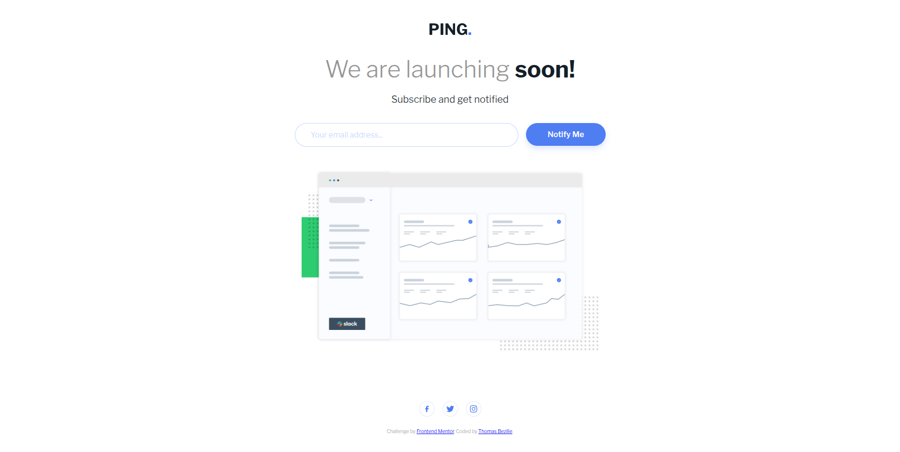
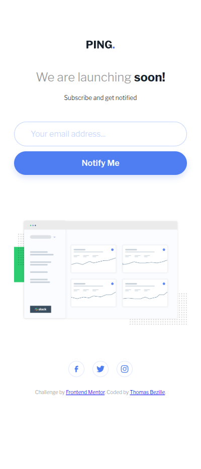

# Ping — Coming Soon Page

> Une page « bientôt disponible » avec inscription par email et validation en temps réel, construite en React.




**🔗 [Demo en ligne](https://front-end-mentor-ping-single-column.vercel.app/)**

---

## 🎯 Objectif

Ce projet est un exercice issu du challenge [Frontend Mentor — Ping single column coming soon page](https://www.frontendmentor.io/challenges/ping-single-column-coming-soon-page-5cadd051fec04111f7b848da). L'objectif était de reproduire fidèlement le design fourni tout en le construisant avec **React + Vite** plutôt qu'en HTML/CSS simple. J'ai particulièrement travaillé le découpage en composants, la validation de formulaire et un layout qui s'adapte au viewport.

**Ce que j'ai appris :**

- **Composants React** : découper l'interface en composants réutilisables (`SubscribeForm`, `SocialLinks`) et gérer l'état avec `useState`.
- **Validation de formulaire** : valider une adresse email côté client et afficher un état d'erreur accessible (`aria-invalid`, `role="alert"`).
- **Responsive & layout viewport** : une approche mobile-first et une adaptation desktop pour que toute la page tienne sans scroll (`clamp`, unités `vh`).
- **Police auto-hébergée** : intégrer la police *Libre Franklin* en local via `@fontsource` plutôt que via un chargement externe Google Fonts, pour un rendu fiable et sans dépendance réseau.

---

## 🛠️ Stack

[](https://react.dev)
[](https://vite.dev)
[](https://javascript.info)
[](https://w3.org/Style/CSS)

---

## 🚀 Lancer le projet

```bash
# Cloner le dépôt
git clone https://github.com/Thomas-Bezille/FrontEnd-Mentor_Ping-single-column-coming-soon-page.git
cd FrontEnd-Mentor_Ping-single-column-coming-soon-page

# Installer les dépendances
npm install

# Lancer en développement
npm run dev
```

Le projet tourne sur [http://localhost:5173](http://localhost:5173).

Pour générer la version de production : `npm run build` (puis `npm run preview` pour la prévisualiser).

---

## 👤 Contact

**Thomas Bezille** — Développeur web à Nantes

[](https://www.linkedin.com/in/thomas-bezille/)
[](https://github.com/Thomas-Bezille)
